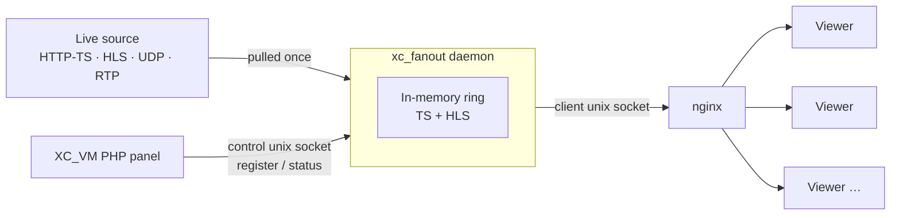

<div align="center">

# XC_VM_Fanout

**Native live-stream fan-out daemon for the [XC_VM](https://github.com/Vateron-Media) IPTV panel.**

One process pulls each live source **once** and fans it out to many viewers through nginx —
keeping PHP out of the byte path and producing HLS (incl. AES-128) **entirely in memory**.

[](LICENSE)
[](go.mod)
[](#installation)
[](https://github.com/Vateron-Media/XC_VM_Fanout/releases)
[](#build-from-source)

</div>

---

## Overview

In the legacy scheme a separate PHP worker was pinned to **every viewer**, so the source was
re-pulled and the byte path re-served per connection — the panel's PHP workers, not the
network, were the ceiling.

`xc_fanout` moves that hot path into a single native daemon. It pulls each live source exactly
once, holds a small in-memory ring, and serves every viewer from it as a cheap connection.
The PHP panel only _controls_ the daemon; it never carries video. Scaling becomes a function
of network and memory, not of worker count.

## Highlights

- **Pull once, fan out to many** — a viewer is a connection, not a pinned worker.
- **HLS in memory** — `.m3u8` + segments produced on the fly, including **AES-128** encryption, with no on-disk segment store.
- **No transcoding for the common case** — an in-process native remuxer serves plain MPEG-TS / HLS sources with **no per-stream `ffmpeg` child**; unsupported sources degrade cleanly to `ffmpeg`.
- **On-demand lifecycle** — the puller starts on the first viewer and stops after the last one leaves; an idle reaper reclaims resources.
- **Live, self-healing configuration** — buffer / HLS / idle tuning lives in a JSON file the daemon self-creates, backfills, polls, and applies without a restart.
- **Bounded memory** — a soft `GOMEMLIMIT` derived from the cgroup or host budget, plus periodic idle-heap scavenging back to the OS.
- **Single static binary** — pure Go, `CGO_ENABLED=0`; one self-contained binary per architecture runs on any Linux distro.

## How it works



The daemon exposes **two HTTP surfaces on separate unix sockets**:

| Surface     | Socket  | Audience               | Purpose                                                                                   |
| ----------- | ------- | ---------------------- | ----------------------------------------------------------------------------------------- |
| **Client**  | `-sock` | nginx-facing (viewers) | `GET /live/<id>`, `GET /hls/<id>/index.m3u8`, `GET /hls/<id>/<seq>.ts`                    |
| **Control** | `-ctl`  | PHP panel only         | `PUT` / `DELETE /streams/<id>` to register / unregister a source; status & reconciliation |

## Installation

Binaries are shipped as **GitHub Release assets** — the source lives here, the compiled
binaries are never committed (`dist/` is gitignored). The panel installs and keeps the daemon
up to date for you:

```bash
console.php fanout_binary          # install or update to the latest release
console.php fanout_binary force    # reinstall the current version
```

The panel reads the installed version straight from the binary (`xc_fanout -version`), compares
it to the latest release tag, downloads the architecture-matched asset, verifies its SHA-256,
installs it atomically, and lets the `service` keepalive respawn the daemon.

Prebuilt targets: `linux/amd64`, `linux/arm64`, `linux/armv7`, `linux/386`.

## Usage

```bash
# Run the daemon (paths shown are the defaults)
xc_fanout -sock /home/xc_vm/bin/xc_fanout/sockets/http.sock \
          -ctl  /home/xc_vm/bin/xc_fanout/sockets/control.sock

xc_fanout -version      # print version + attribution
xc_fanout -h            # full flag reference
```

**Native remux sub-command** — the in-process equivalent of a copy-only `ffmpeg`, which the
panel runs under the daemon's supervisor in place of a per-stream `ffmpeg`:

```bash
xc_fanout remux -i <url> [options] <playlist.m3u8>
xc_fanout remux -h
```

Operator tuning (prebuffer, HLS window, grace, timeouts, memory limit, source backend) is **not**
CLI flags — it lives in the panel-editable JSON config the daemon self-heals and applies live.
See **[06 · Configuration](docs/en/06-configuration.md)**.

## Documentation

Full documentation lives in **[`docs/`](docs/README.md)** ([Русский](docs/ru/README.md) · English),
split one topic per file:

| #   | Topic                                                    | About                                                                             |
| --- | -------------------------------------------------------- | --------------------------------------------------------------------------------- |
| 01  | [What it is](docs/en/01-what-is-it.md)                   | The problem it solves, in plain terms. Start here.                                |
| 02  | [Architecture](docs/en/02-architecture.md)               | What it's built from and how bytes travel source → viewer.                        |
| 03  | [Endpoints](docs/en/03-endpoints.md)                     | Full HTTP reference for both surfaces.                                            |
| 04  | [Internals](docs/en/04-internals.md)                     | Fan-out, clean join, prebuffer, HLS segmentation, encryption, source acquisition. |
| 05  | [Lifecycle](docs/en/05-lifecycle.md)                     | On-demand start/stop, pull/push/launch modes, the reaper.                         |
| 06  | [Configuration](docs/en/06-configuration.md)             | CLI flags and the live, self-healing JSON config.                                 |
| 07  | [Integration](docs/en/07-integration.md)                 | How nginx, PHP, `fanout_sync` and binary install fit together.                    |
| 08  | [Build, test, release](docs/en/08-build-release.md)      | Building, the test layout, cutting a version.                                     |
| 09  | [Encoder supervision](docs/en/09-encoder-supervision.md) | Runbook for the daemon watching stream encoders.                                  |

Design decisions are recorded as ADRs in [`docs/adr/`](docs/adr/).

## Build from source

Pure Go, no external module dependencies — only the standard library.

```bash
go build ./cmd/xc_fanout          # local build
./release.sh                      # all target arches → dist/* + SHA256SUMS (+ LICENSE/NOTICE)
```

`release.sh` builds a **static** binary (`CGO_ENABLED=0`, `-trimpath`) for every target
architecture and aborts if any output is not fully statically linked. Requires **Go ≥ 1.21**.

## Testing

```bash
go test ./...          # unit tests — fast, no network or daemon needed
go test -race ./...    # with the race detector — run before every release
go test -cover ./...   # per-package coverage
go vet ./...
```

What each package tests, how the `ffmpeg` paths are exercised (a fake stand-in for
deterministic branches, the real system `ffmpeg` for the overlay re-encode), and the
end-to-end Docker bench in [`test/`](test/) are documented in
[08 · Build, test and release](docs/en/08-build-release.md#testing).

## Releasing

The version number lives in the **`VERSION`** file — the single source of truth:

```bash
echo 0.13.1 > VERSION                                # bump
./release.sh                                         # test + build dist/* + SHA256SUMS
git commit -am "release $(cat VERSION)" || true     # skip if VERSION is already committed
git tag "$(cat VERSION)" && git push --tags         # the tag push triggers the release
```

Pushing the version tag (no `v` prefix) triggers
[`.github/workflows/release.yml`](.github/workflows/release.yml), which rebuilds the binaries,
generates a changelog from the commits since the previous tag, and attaches `dist/*` — binaries,
`SHA256SUMS`, `LICENSE`, `LICENSE-ADDITIONAL-TERMS.md` and `NOTICE` — to the GitHub Release.

## Acknowledgements

XC_VM_Fanout began as a Vateron Media design and grew with community help. Special thanks to
[**@obscuremind**](https://github.com/obscuremind) for building on the original idea — refining
it and contributing new features to the daemon.

Contributions are welcome: open an issue or a pull request.

## License

XC_VM_Fanout is licensed under the **GNU AGPL-3.0-or-later** (see [`LICENSE`](LICENSE)), with
**additional terms** under Section 7 of the AGPL (see
[`LICENSE-ADDITIONAL-TERMS.md`](LICENSE-ADDITIONAL-TERMS.md)). In plain terms — the license files
are what actually binds:

- **Modifying fanout is copyleft.** Any change or fork must be released under AGPL-3.0. Because it's the _Affero_ GPL, this holds even when you only run the modified daemon on a server and never distribute it (the SaaS case).
- **Using fanout as a separate process can stay closed.** A separate program that only runs the daemon and talks to it over its CLI, sockets, HTTP, or files is not a derivative work and may be proprietary. This does **not** cover linking fanout's Go packages into your binary — that stays under the AGPL.
- **Shipping or auto-downloading the binary requires attribution.** Any project, installer, distribution, or service that ships or fetches the fanout binary must display: _XC_VM_Fanout — Copyright (C) 2026 Vateron Media — https://github.com/Vateron-Media/XC_VM_Fanout — Licensed under AGPL-3.0_.
- **Forks must say so.** A fork must state it is based on XC_VM_Fanout, link the original, and keep the attribution shown by `xc_fanout -version`.

Copyright (C) 2026 Vateron Media.
